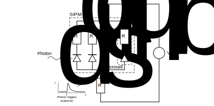

# SiPMSim

**This project is work in progress.**

SiPMSim is a behavioural simulator of Silicon Photomultiplier written in C++.
The simulator is work in progress and should be used later in the development of an detector system for Cherenkov light.

In this document I will provide a brief introduction to Silicon Photomultipliers, their design and properties.

The simulator will be described afterwards. 

## Silicon Photomultiplier

A Silicon Photomultiplier (SiPM) is a semiconductor device for detecting light. It consists of an array of parallel connected pixels or microcells. Each microcell consists of an avalanche photodiode (APD) with a quenching resistor connected in series.

The photodiode is operated in the so called Geiger-mode. Hear the diode is reversed biased with an voltage greater than the breakdown voltage of the diode. The bias voltage is given by .

Through the overvoltage it becomes possible for a photon that hits the diode's charge region to generate a free charge carrier that will be accelerated by the strong electric field. It will generate other charge carriers, that again can generate others. The result is an avalanche breakthrough of the diode which results in a current flowing through the diode. Without measures this avalanche would be self-sustaining. But the current flows through the serial resistor resulting in a voltage drop to the breakdown voltage. The potential is then not high enough to support breakthrough and the current is quenched.

It offers a lot of advantages compared to previous technologies.
SiPM  
* offer single photon detection capability
* exhibit quasi binary response to a photon
* are working
  * at room temperature
  * at (relatively) low voltages (20-90 V)
  * in strong magnetic fields
  
  
## The Simulator

### Development

The simulator realizes (now) a simple algorithms for simulating the noise sources in a SiPM.
The first target is to realize a complete basic simulation algorithm, that serves as the basis for extending the concept.

